# How to deploy Mongo-Express-React-Node app to Vercel 🚀

## 1 - Get the DB connection on MongoDB Atlas
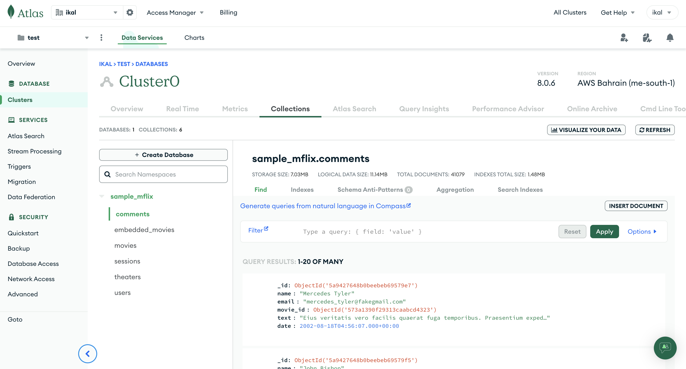

From the previous lab we successfully connecting our MongoDB atlas with our local code. In this example we will use the sample dataset from MongoDB atlas which is `sample_mflix`.

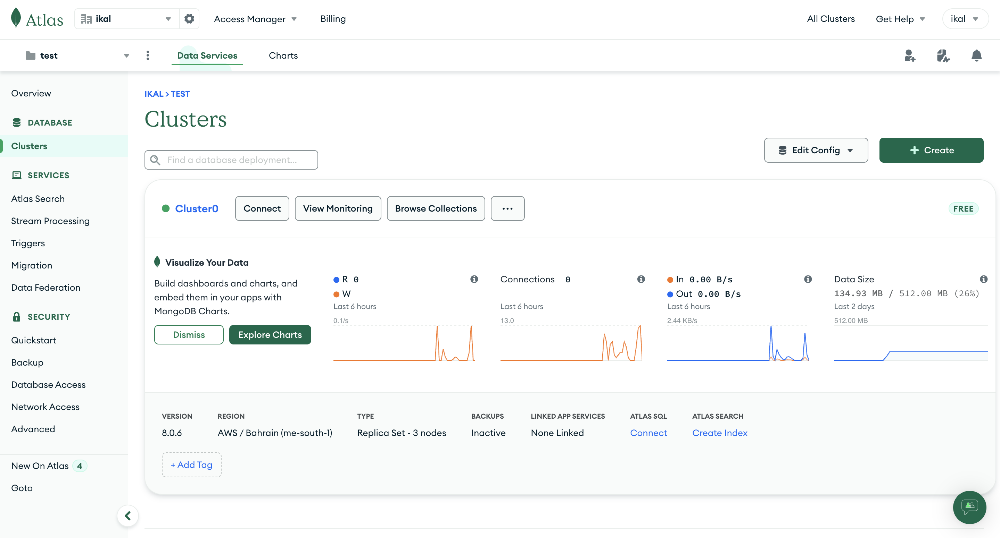

Kindly click `Connect` button

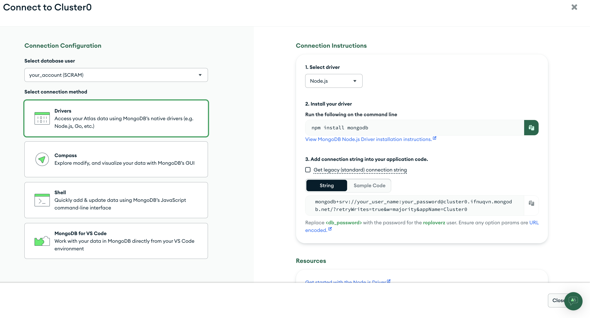

Get the URL DB string, **make sure you still remember your DB username and the password**. It will be used on `api/index.js` line 8, copy and paste it there.

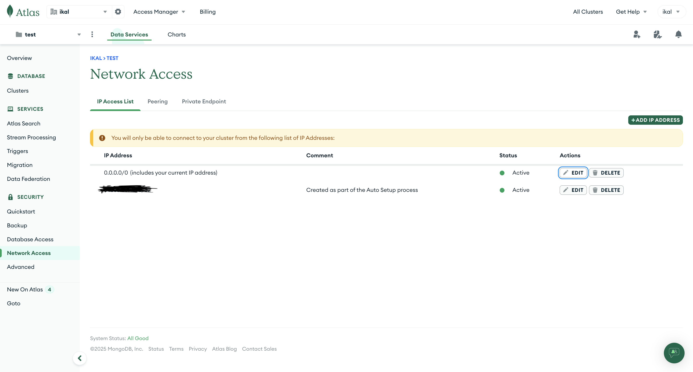

Add the new IP address and set it to allow access from everywhere. Since we using it in educational purpose it's fine, but if we're working in the real project then you should limit the access to your database based on your copmany IP address only.

## 2 - Prepartion
Clone this repository then get inside it
```
git clone https://github.com/rakhid16/mern-vercel-swe.git
cd mern-vercel-swe
```

### 2.1 Backend
Get inside `api` (for backend) directory, then install and run the progran
```
npm i
npm run dev
```
make sure you change the DB URL on the `api/index.js` line 8 to your own DB connection. Then you can access the `localhost:8000/api/hello` and `localhost:8000/api/read_mongodb`. It will show up like this:
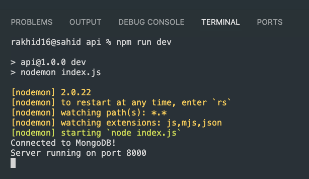

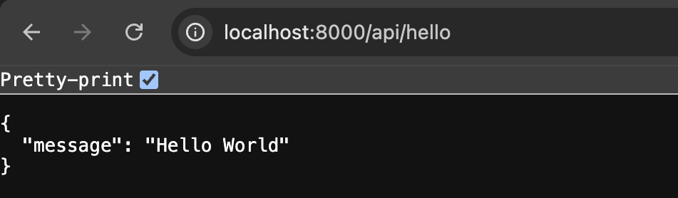

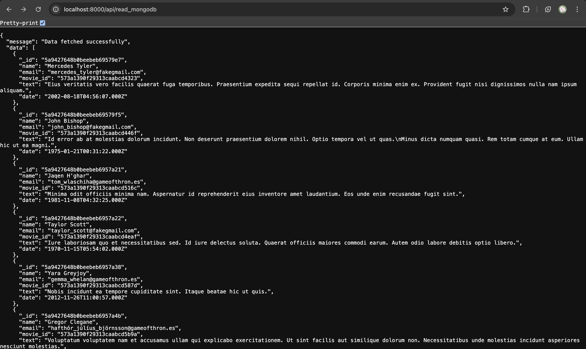

### 2.2 Frontend
To run the frontend server you need to get inside the `frontend` directory and do the same thing:
```
npm i
npm run dev
```
It will showing up like this:

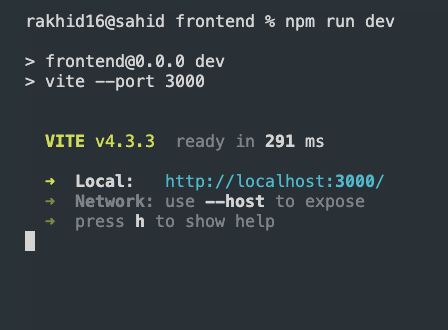

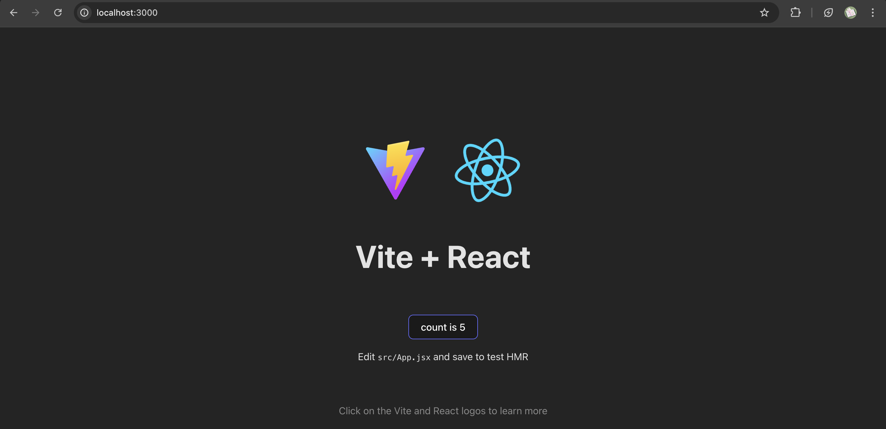

## 3 - Vercel deployment
**Do not push your DB credentials into github repository!**. Create the `.env` file to put yout credentials there, so your directory will be like this:

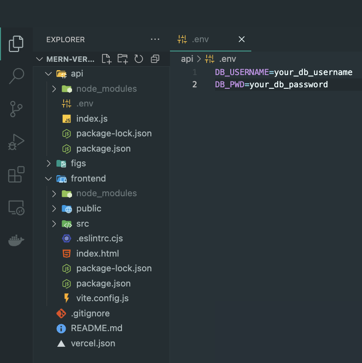

Please follow the format for const uri or you can modify the `api/index.js` code (line 8) `.env` credentials based on your needs. The poin is, don't put your username and password in the files that you're going to push into the Github repository.

Please push the code on your own repository, before doing it you can delete the `.git` directory (hidden folder) so there are no previous commit histories and you can do the fresh push.

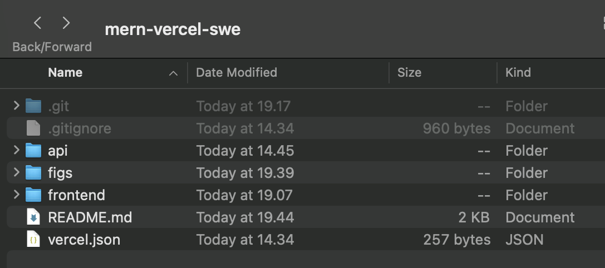

Okay, after you successfully run on your device let's move to the vercel deployment.

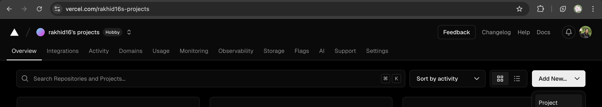

Click the white/black button `Add new...` -> `Project`

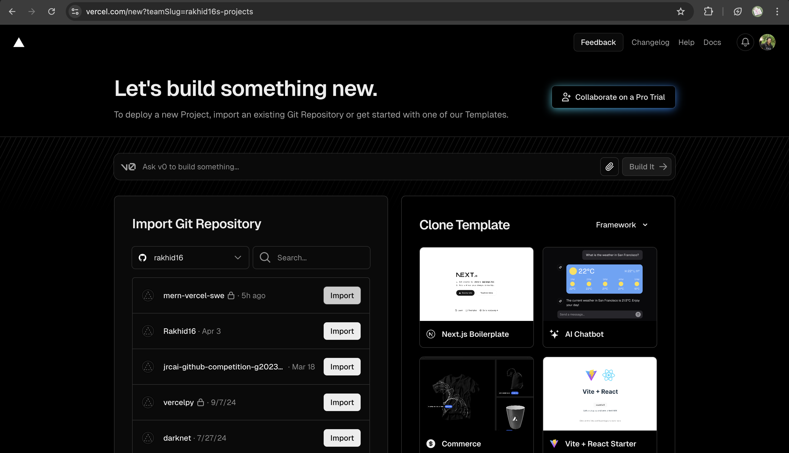

Choose the repository containing the current project.

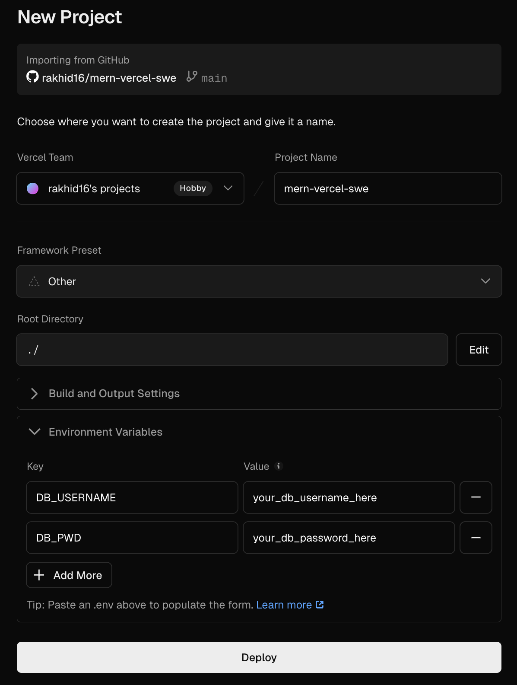

Please put all the content of `.env` file into `Environment Variables` section. We do not want to push our `.env` into Github repository.

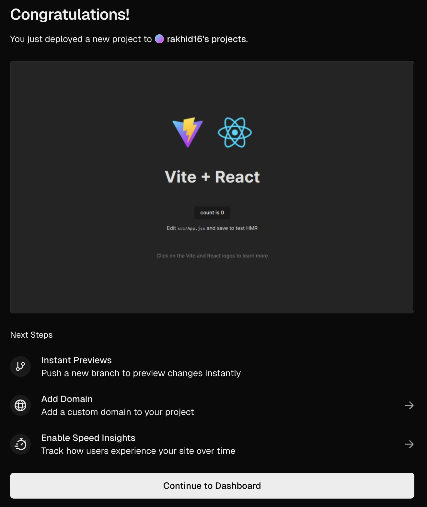

Alhamdulillah, it's deployed. You can check it here https://mern-vercel-swe.vercel.app/

Feel free to open an [issue](https://github.com/rakhid16/mern-vercel-swe/issues) if there are any trouble, so I can help you to fix something for your deployment.